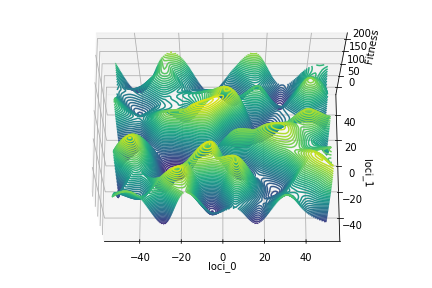
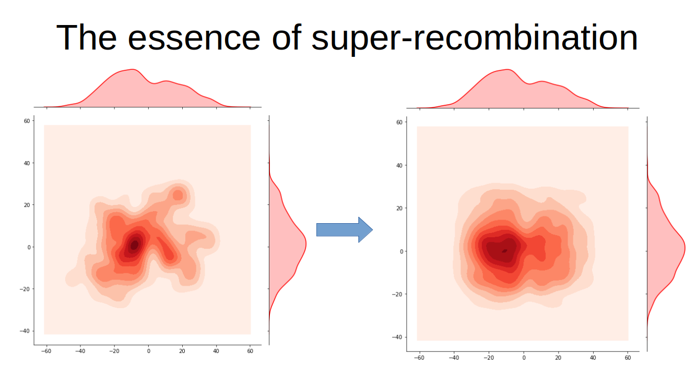

# Sex vs Asex : Gains in diagonality due to recombination
A brief description:

The question of why sexual replication exists becomes really interesting as you think about it. It seems, at first, to have serious diadvantages when compared to asexual replication strategies. An obvious one being that sexual populations will grow much slower - since they must expend energy and time in finding a mate. If we assume that each organism only has enough energy to contribute to only two offspring, the asexual population can grow exponetially faster than the sexual population.

  

But given the prevalence of sexual replication in nature, there must be some great benefit of replicating in this way. Also, given that even some quite simple organisms replicate sexually (e.g. Bacterial Conjugation), we want out explanation to be as "simple" as possible, avoiding things like selective mating etc.

I'm approaching the question from a mathematical lens. The first stage of my research involved creating a series of simulations, for which this is the code. In these I create two populations, one which replicates sexually and the other which replicates asexually. Each organism's genes are represented by a list of N numbers (e.g. [3132, 6, 1232, 12...]) - we can think about each organisms gene as representing a point in an N-dimensional space (the N here is pre-set). Then we map each sequence of genes to some fitness level. This is easily visualised for the case where N = 2. Here the organisms have a gene sequence of two numbers, say [10, 25] which can be thought of as a point in a 2d plane. Then, to each point in this 2d plane, we assign some fitness value, so you end up getting a hilly landscape like this (gene sequence [10,25] -> loci_0 = 10, loci_1 = 25):

  

    
Now in the simulations, I get two populations, one which replicates sexually and the other asexually - this process is entirely independent of the fitness values assigned to each organism. For the asexuals, they simply duplicate themselves. However the sexual replication process is a lot more interesting. In my model, I essentially have the population undergo a super recombination of the genes. It is as if, for each loci (position in the gene sequence) I take the genes (numbers) of the entire population and shuffle them around randomly. So, say I had a sexual population of size 3:  [13, 123], [231, 65], [1123, 14], the first step of the super recombination would suffle the first numbers of each of these organisms randomly, so you might get [231, 123], [13, 65], [1123, 14]. Then we would shuffle the secound numbers in the gene sequence and so on. This shuffling is mathematically equivalent to the population undergoing standard, pair based, sexual mixing lots and lots. Below is a picture illustrating how such sexual recombination effects out population's distribution (in the N=2 case):

  

Now the aim is to ofcourse understand how the two populations, sexual and asexual, perform on general, random, fitness landscapes.

Investigating mathematical models which attempt to explain the prevalence of Sexual replication, despite it's seeming 
evolutionary costs. I focus on the performance of asexual vs sexual replication strategies on random fitness landscape 
(Euclidean) in N dimensions.

The initial results of the simulations have suggested a hypothesis that extends the work of Andrew Lewis Pye's Paper:
Sex vs Asex: the role of varience conversion (https://lewispye.files.wordpress.com/2018/08/svsastp3.pdf). It seems that
the papers results may be generalisable to many different fitness landscapes (comapred to just the linear or product cases
considered in the paper). Namely, sexual recombination increases varience of the sexual population in 'diagonal'
directions, enabling it to move faster into such directions. This enables the sexual population to excel when moving in
these 'diagonal' directions confers a fitness advantage. Not only that, but the sexual recombination process entails
no disadvantage when moving 'not diagonally', meaning it is competitive in that case also!

You can expect a full formal analysis up here by June 2020.

Background note:

Sexual replication has many seeming issues in comparison to asexual replication. From the nineteenth century, it has 
been recognized that, since there is no obvious advantage to the individuals involved, the advantages of sexual reproduction 
must be evolutionary. Furthermore, the advantage must be substantial; for example, producing males entails a two-fold cost, 
compared to dispensing with them and reproducing by parthenogenetic females. There are a large number of plausible hypotheses. 
To me the most popular of these are two: The first hypothesis, and the oldest, is that sexual reproduction offers the 
opportunity to produce recombinant types that can make the population better able to keep up with changes in the environment. 
Second, species with sexual recombination can bunch harmful mutations together and eliminate several in a single 
"genetic death." Asexual species, can eliminate them only in the same genotype in which they occurred.
